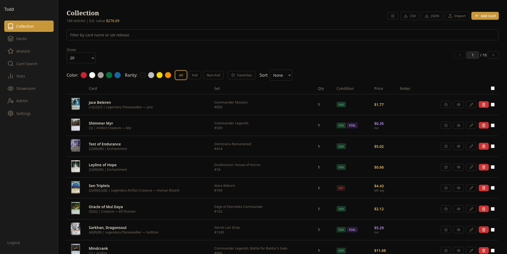
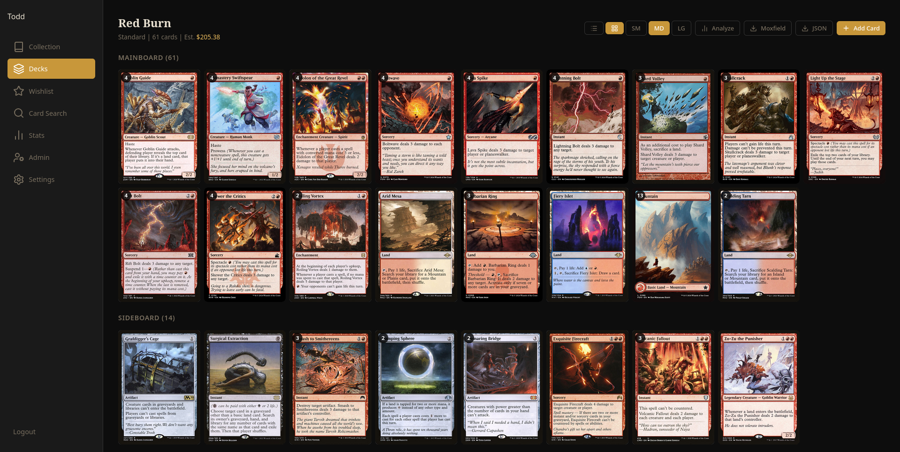
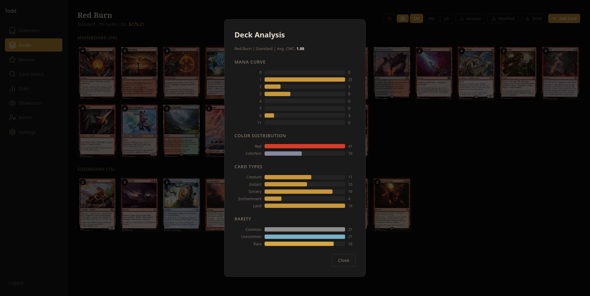
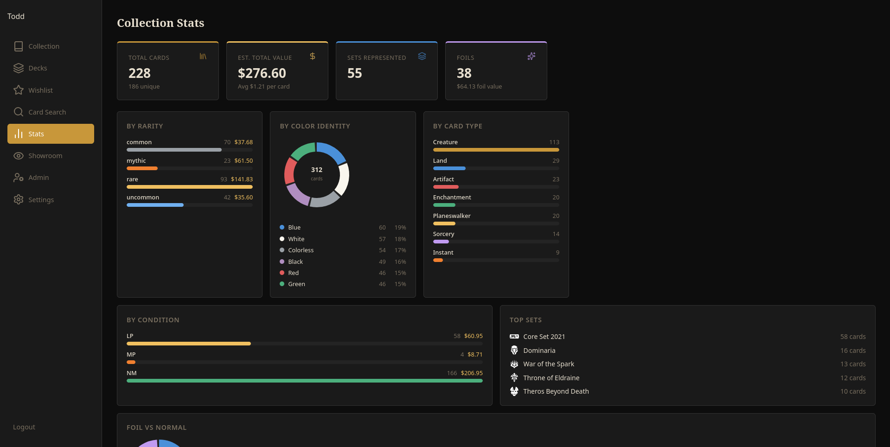
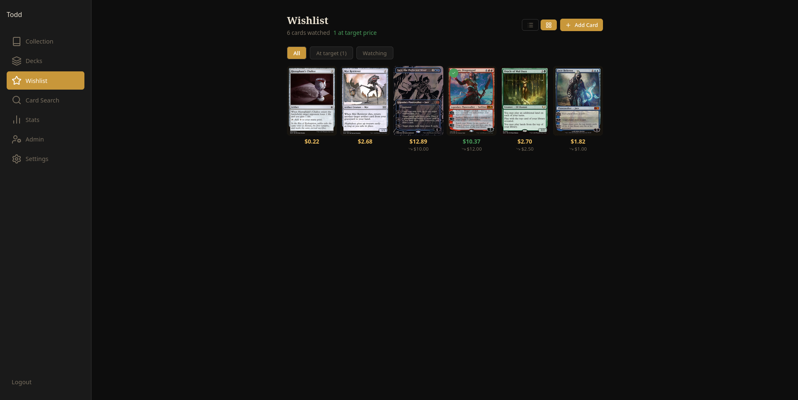
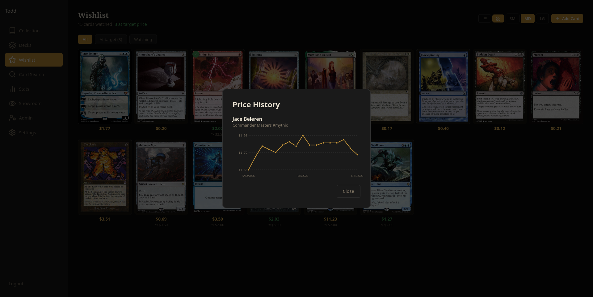
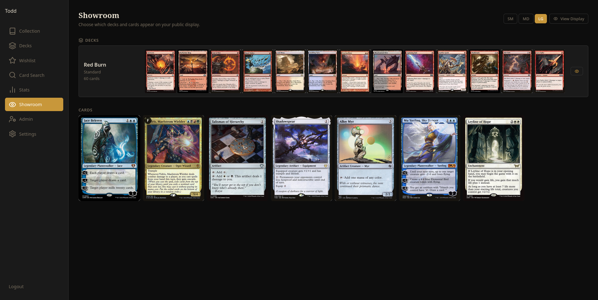

# OpenMTG


Self-hosted MTG card inventory server with multi-account support, collection tracking, deck building, statistics, wishlist, public Showroom display, card trading, loan tracking, card photos, and import/export. Built with FastAPI and React, deployed with Docker.

---

## Features


- **Collection Management** - Add cards by name with fuzzy Scryfall search, track quantity, condition, foil, language, price, and set printing.
- **Price Tracking** - Automatic price refreshes from Scryfall with configurable intervals and rate limiting.
- **Import / Export** - Export collections and decks in multiple formats.



- **Deck Builder** - Build decks with mainboard, sideboard, and commander zones. Includes a Deck Analysis to show statistics like Deck CMC, Mana Curve, and Color Distribution.


- **Statistics** - Visual breakdowns of your collection by rarity, color, type, condition, set, and estimated value.



- **Wishlist** - Add cards to a Wishlist to keep track of current price, 90-day price history, and alerts when cards dip below target prices.


- **Showroom** - Curate a public display of decks and individual cards, viewable without logging in. Suitable for a TV, tablet, or kiosk. The full collection is never exposed, only what the user explicitly selects. Can be disabled per-instance from the Settings panel.
- **Deck Import** - Paste a Moxfield, MTGO, or Arena deck list to create a populated deck in one step, with a real-time per-card progress indicator.
- **Multi-Account** - Admin-managed user accounts where each user has their own isolated collection.
- **Quick Add** - Fast card entry with live Scryfall lookup and set picker.
- **Favorites** - Mark and sort cards in the Collection with a 'Favorite' button.
- **Currency** - USD and EUR supported natively. Admins can add custom currencies (CAD, GBP, AUD, etc.) via the Admin panel. Rates are fetched and refreshed automatically.
- **Card Trading** - Propose and complete card trades with other users on the same instance. Both sides confirm before cards auto-transfer between collections. Trade history stored separately.
- **Loan Tracking** - Mark cards in your collection as on loan with a recipient name and date. Loaned cards display a badge in the Collection view.
- **Card Photos** - Upload front and back photos for individual cards in your collection. Photos are viewable by trade counterparts when reviewing a trade offer.

---

## Roadmap

### Release Plan

- **v1.10** - Home Assistant Integration: webhooks for custom dashboards, price alerts, and watchlist notifications

### Short-term

- **Set Completion** - Appending the statistics page to include per-set completion for the collectors.
- **Expand Import/Export** - Expand accepted import formats beyond Moxfield/MTGO/Arena, and add collection export format options.

### Long-term

- **Bulk Data Download** - Scryfall allows for users to download the full catalog of card information. An option is planned to allow users to download the entire database at once for faster card lookups.

### Not Planned

- **Card Scanning** - Requires either a GPU for image hashing or a cloud ML service, both out-of-scope for this project.
- **Native Android/iOS App** - Solo development would be spread too thin to support both the Docker image and an app.
- **Cloud sync/Backup** - Existing applications exist for full system backups, also out-of-scope for this project. Minor database error-handling is in consideration.

---

## Stack

| Layer | Technology |
|---|---|
| Application | Python 3.14, FastAPI, SQLAlchemy, Alembic, React, Vite, TanStack Query |
| Database | PostgreSQL 16 |
| Reverse Proxy | Nginx |
| Container | Docker + Docker Compose |

---

## Quick Start

- [Docker](https://docs.docker.com/get-docker/) and [Docker Compose](https://docs.docker.com/compose/install/)

### 1. Pull the image

```bash
docker pull ghcr.io/dredbaron/openmtg:latest
```

### 2. Create your environment file

Create the file and fill in your values:

```bash
cat <<EOF > .env
POSTGRES_DB=openmtg
POSTGRES_USER=openmtg
DB_PASSWORD=your_secure_password_here
JWT_SECRET=your_long_random_secret_here
DATA_PATH=./data
CONFIG_PATH=./config
UPLOADS_PATH=./uploads
TRADES_PATH=./trades
EOF
```

> **Tip:** Generate a strong JWT secret with `openssl rand -hex 32`

### 3. Create your docker file

Use the default `docker-compose.yml` as a template for this docker file.

### 4. Start the stack

```bash
docker compose up -d
```

OpenMTG will be available at **http://localhost:8080**

### 5. First-time setup

On first launch you will be prompted to create an admin account. After that, only admins can create additional user accounts.

For a more detailed install guide, see the [Install Guide](https://github.com/DredBaron/OpenMTG/wiki/Installation) in the Wiki.

---

## Updating

```bash
docker compose pull
docker compose up -d
```

Database migrations run automatically on startup.

---

## Opt-In Telemetry

As of v1.4.0, OpenMTG includes an optional telemetry feature to help estimate active usage. When enabled, the app generates a random anonymous ID and sends a once-daily heartbeat containing only that ID and a timestamp. No personally identifiable information is collected, and participation is entirely voluntary. The ID is created only after opting in and is deleted if you opt out. Telemetry data is used solely for development purposes and is never shared or sold.

To disable telemetry prompts entirely, edit your .env file to add the following line:

```bash
NOTEL=true
```

For additional details in removing all future telemetry-based features, please see the [Telemetry Wiki](https://github.com/DredBaron/OpenMTG/wiki/Telemetry) page.

## Configuration

All configuration is done via the `.env` file or the admin **Settings** panel in the UI.

| Variable | Description | Default |
|---|---|---|
| `POSTGRES_DB` | Database name | `openmtg` |
| `POSTGRES_USER` | Database user | `openmtg` |
| `DB_PASSWORD` | Database password | *(required)* |
| `JWT_SECRET` | Secret key for auth tokens | *(required)* |
| `DATA_PATH` | Path for PostgreSQL data volume | `./data` |
| `CONFIG_PATH` | Path for app config volume | `./config` |
| `UPLOADS_PATH` | Path for card photo uploads | `./uploads` |
| `TRADES_PATH` | Path for trade history database | `./trades` |
| `NOTEL` | Option to disable telemetry settings | Not present by default |

### Price Refresh Settings (Admin UI)

| Setting | Description | Default |
|---|---|---|
| Auto-refresh interval | How often stale prices are refreshed | 72 hours |
| Scryfall rate limit | API requests per second | 1 req/s |

### Feature Toggle Settings (Admin UI)

| Setting | Description | Default |
|---|---|---|
| Showroom | Enables the public Showroom display page, nav link, and per-card/per-deck visibility toggles | Enabled |
| Card Search | Enables the Card Search page and nav link | Enabled |
| Trades | Enables the Trades page, nav link, and trade proposal workflow between users | Enabled |

---

## Ports

By default, OpenMTG listens on port **8080**. To change it, edit the `nginx` service in `docker-compose.yml`:

```yaml
ports:
  - "YOUR_PORT:80"
```

---

## Building from Source

```bash
git clone https://github.com/dredbaron/OpenMTG.git
cd OpenMTG
cp .env.example .env
# edit .env with your values
docker compose up -d --build
```

---

## License

[GNU Affero General Public License v3.0](LICENSE)

You are free to use, modify, and self-host OpenMTG. If you distribute a modified version or run it as a network service, you must make your source code available under the same license.

---

## Acknowledgements

Card data and pricing provided by [Scryfall](https://scryfall.com). Please respect their [API guidelines](https://scryfall.com/docs/api) and rate limits.
 
---
 
## Development History

This project was initially conceived with AI reference (Claude by Anthropic) 
as a learning exercise in building self-hosted MTG collection tools, as well
as understanding Docker image development processes. Active development is
now entirely human-driven.

AI was used only as an initial development reference to determine feasability
of the idea and the likely scope of the project. Any and all AI-suggested
code has undergone active removal and replacement with human-written code.

Contributions are welcome and reviewed by human maintainer(s) only.

---

## Credits

Favicon icon by [Faithtoken](https://game-icons.net/1x1/faithtoken/card-pick.html), licensed under [CC BY 3.0](https://creativecommons.org/licenses/by/3.0/).

Card data, imagery, and pricing provided by [Scryfall](https://scryfall.com), used in accordance with their [API Terms of Service](https://scryfall.com/docs/api). Scryfall is not affiliated with or endorsed by Wizards of the Coast.

## Notes

This repository underwent a full re-commit on April 1, 2026, which caused all commits to be pushed at the same time after SSH/GPG signing.
